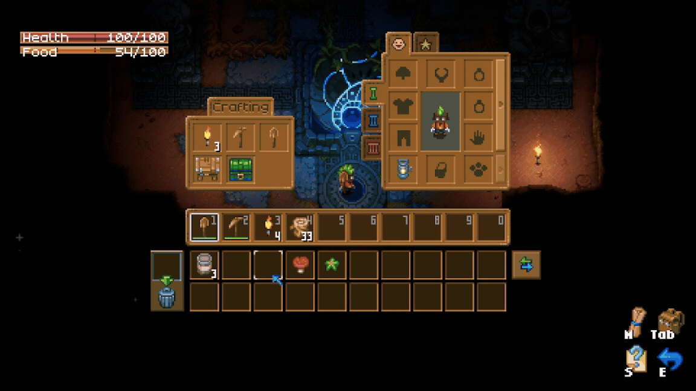
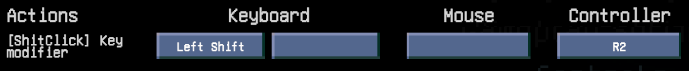

# ShiftClick

QOL Inventory mod for Core Keeper. 

This mod provides a better experience when moving items from hotbar, inventory and chest storages.

---

## Usage

Press `ModifierKey` and click on item you want to move. The selected item will be moved to next available inventory/hotbar or chest slot.

### ModifierKey
 - Keyboard: ``LShift``
 - Controller: ``R2 / Right trigger``

> **Default ``ModifierKey`` can be changed in the settings menu.**
> 
> 

 

---

## Feedback

If You have any feedback, or You have found a bug, feel free to create an [issue.](https://github.com/HubertLipinski/ShiftClick/issues/new/choose)

